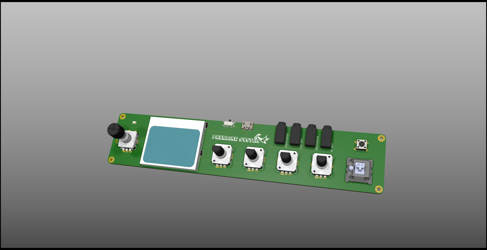
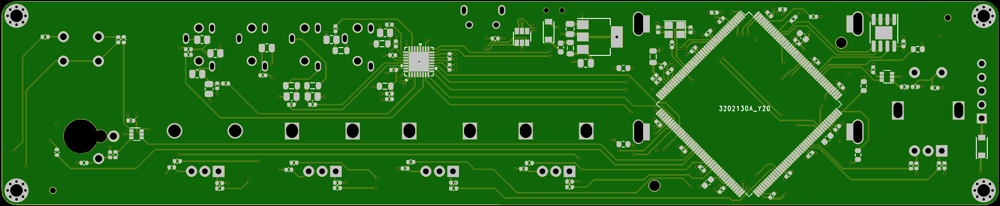
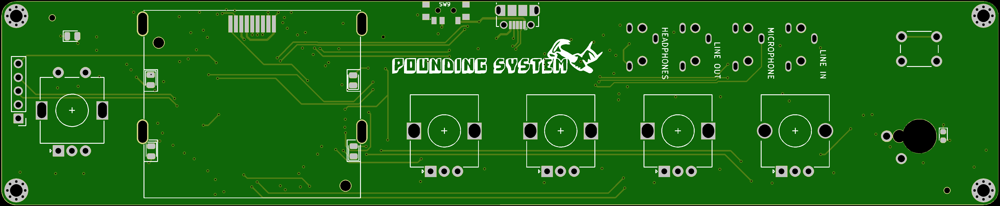

# Pounding System Hardware

This is the central repository for the Pounding System hardware design files. The project is created with KiCad v5. To be used with the Pounding System software which will be published in early 2021.

## Main Components

- STM32H7 Microprocessor
- Wolfson WM8978 Audio Codec
- Nokia 5110 LCD
- 1 x ALPS EC11 Encoder + Switch
- 4 x ALPS EC12 Encoders
## Renders

